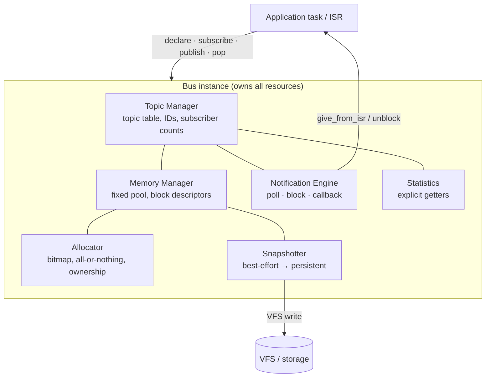
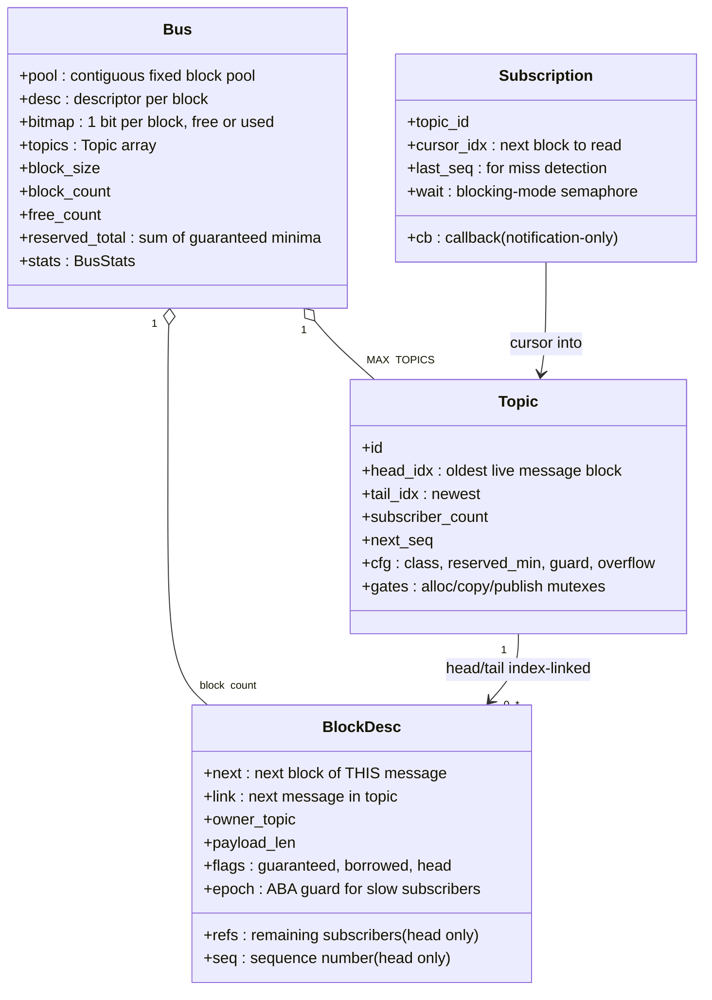
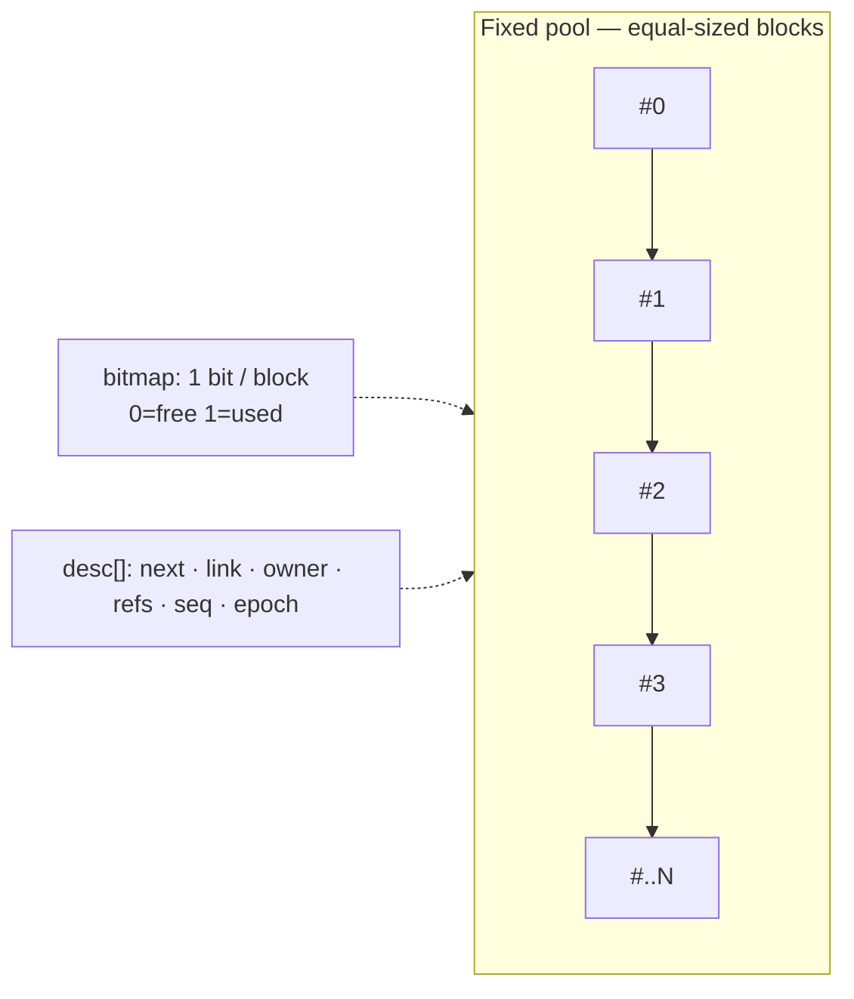
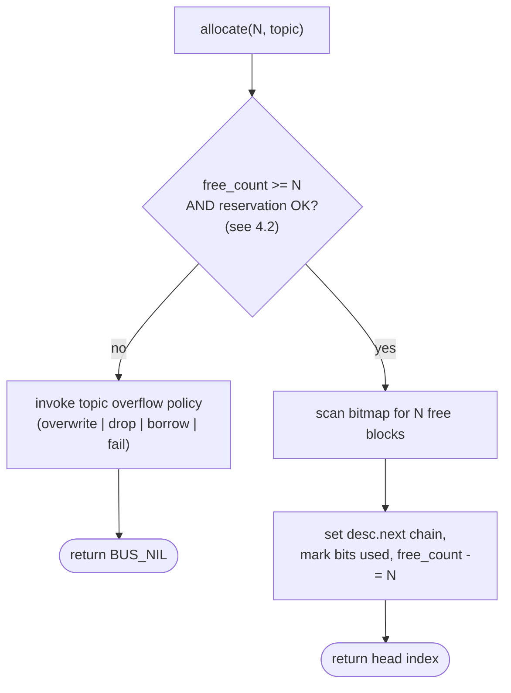
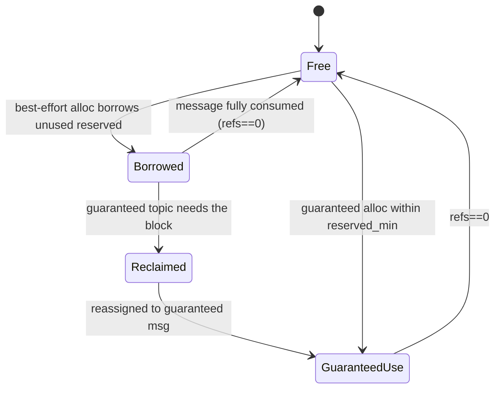
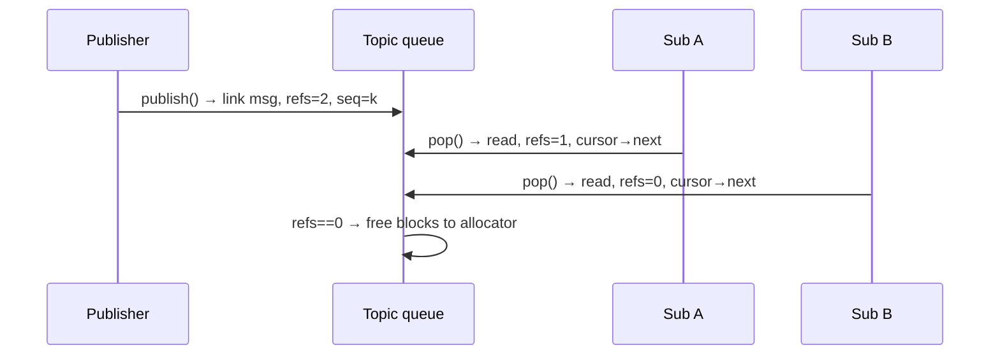
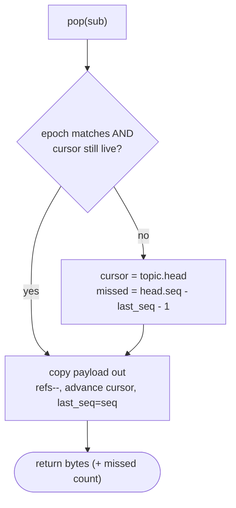
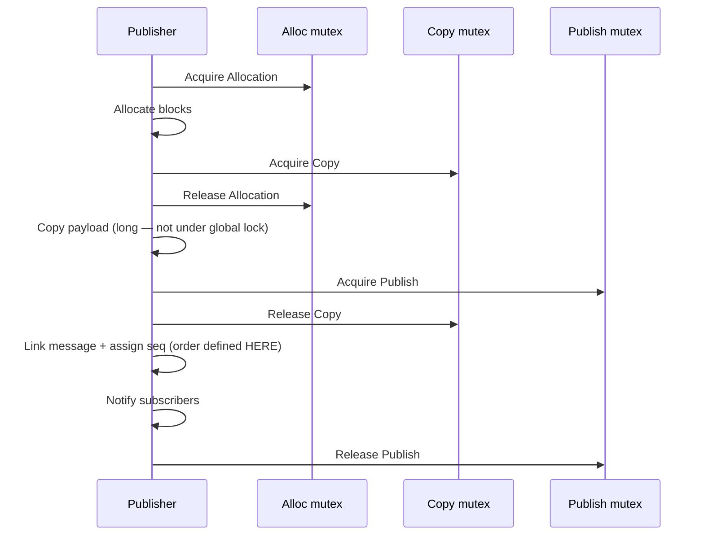

# Plan — Bus IPC Subsystem

**Date:** 2026-07-02
**Status:** Draft — design & phased implementation plan for review
**Scope:** single MCU, single firmware, single address space
**Source:** `Bus Subsystem Design Document`
**Branch:** `feat/bus-subsystem`

The Bus is a kernel-level inter-process communication (IPC) subsystem: a unified
publish/subscribe fabric for deterministic real-time data, best-effort traffic,
logging, and event notification on a resource-constrained MCU. It is **payload
agnostic — it moves bytes, not types.**

This document is code-grounded. Every primitive it builds on is a real symbol in
the tree today; every gap it must fill is called out explicitly with the chosen
solution. Line anchors (`file:line`) are valid as of writing and may drift.

---

## 0. Design goals & non-goals

Priority order (from the source document, unchanged):

1. Correctness and reliability.
2. Deterministic behavior for critical communication.
3. Efficient memory utilization.
4. Efficient CPU utilization.
5. Low wiring (coupling) between software modules.
6. Localized debugging and observability.
7. Flexible policy without unnecessary restriction.

**Non-goals** — the bus does **not** distribute across nodes,
interpret payloads, serialize, implement transport protocols, or guarantee
consistent snapshots. Those responsibilities live above or beside the bus.

Guiding rule, and the tie-breaker for every open question below:

> **Mechanism, not policy.** The application declares topology, guarantees, and
> overflow behavior; the bus only enforces correctness, determinism, and
> resource management. Every mechanism must exist to preserve an explicit
> guarantee — never to grow the feature count.

---

## 1. Fit with the existing kernel — reuse vs. build

The bus is *not* greenfield. vaios already ships most of the hard concurrency
machinery. The design maximizes reuse so the new surface is small and testable.

| Need | Reuse (exists today) | Build (gap) |
|---|---|---|
| Blocking wait + timeout + priority inheritance | `sema_t` / `rmutex_t`, `v_semaphore_take(h, ticks)`, `v_mutex_lock(h, ticks)` — `include/ipc.h:45-90`, PI chain-walk `kernel/ipc.c:220-234` | — |
| ISR → task wakeup | `v_semaphore_give_from_isr(h, &woken)` — `ipc.h:72`, `ipc.c:303` | — |
| Per-topic queue (multi-consumer) | `mpmc_queue_t` (mutex + `not_empty`/`not_full` sems) — `structure.h:73-105` | Ref-counted, index-linked variant (see §5) |
| Low-latency single-writer path | `spsc_fifo_t` lock-free ring, caller buffer — `structure.h:22-63` | — |
| Absolute-deadline timebase | `v_get_ticks()` (ms-scale ticks) — `utils.h:12`, `utils.c:925` | — |
| Blocking receive on a task | `task_block()` / `task_unblock(id)` — `task.h:153-156`; or block on a sema | — |
| Config layering | `vaios_config.h` → `vaios_config_default.h` `#ifndef` knobs — `vaios_config.h:1-21` | New `VAIOS_BUS_*` knobs |
| Optional-module build | `VAIOS_MODULE_*` 3-touch pattern — `docs/perf/IMPLEMENTATION_PLAN.md §1` | `VAIOS_MODULE_BUS` |
| **Fixed-block memory pool** | *(none — heap only)* `v_malloc`/`v_free`, segregated lists — `memory.h:24-27` | **Block-pool allocator over a static/`v_malloc`-carved buffer (§4)** |
| **Deferred callback / softirq** | *(none — only PendSV `v_port_trigger_pendsv()`)* `port.h:79` | **Semaphore-woken bus worker task (§6)** |
| **Event/notify, condvars** | *(none)* | **Not needed — semaphores cover blocking mode** |

Three real gaps, all addressed below: **(a)** there is no fixed-block pool
allocator — vaios has only the coalescing heap (`kernel/memory.c`), so the bus
brings its own pool; **(b)** there is no generic deferred-callback/softirq
mechanism — callbacks run on a dedicated worker task woken by a semaphore;
**(c)** there is no task-notify/event-group — unnecessary, semaphores suffice.

---

## 2. Architecture

The application only ever calls `publish()` / `pop()` (and declare/subscribe).
It never touches queues, blocks, or the bitmap directly.



A bus instance owns **all** its communication resources: one fixed memory pool,
a block-descriptor table, an allocation bitmap, a topic table, notification
state, and statistics. **Multiple independent buses may coexist**, each with its
own block size / pool size / policy, so unrelated workloads (flight control vs.
logging vs. vision) stay isolated — a best-effort logging flood on one bus can
never starve the guaranteed control bus.

---

## 3. Data model

Index-based, not pointer-based, throughout the allocator and queues: links are
`uint16_t` block indices into the pool, so the whole structure is
position-independent, compact, and trivially bounds-checkable. `BUS_NIL`
(`0xFFFF`) is the null sentinel.



**Message layout** — every published message is a *Bus Header* + opaque
*User Payload*, spanning one or more linked blocks. The bus never reads the
payload.

```
+------------------+  <- head block
|   Bus Header     |  topic_id · payload_len · timestamp · seq · flags
+------------------+
|   User Payload   |  opaque byte array, continues into `next` blocks
+------------------+
```

Suggested header fields (from source doc): **Topic ID, Payload length,
Timestamp** (`v_get_ticks()`), **Sequence number, Flags**. Timestamp and seq are
assigned by the bus at publish; the app supplies only topic + bytes.

---

## 4. Memory model & the block-pool allocator

**The single biggest gap.** vaios has only a coalescing heap
(`kernel/memory.c`, segregated free lists `memory.c:31-62`). The bus mandates
**no dynamic heap allocation on the data path** and a **fixed pool of
equal-sized blocks**. So the bus brings its own pool allocator, carved once at
`bus_create()` either from a static buffer or a single up-front `v_malloc`
(never per-message).

Layout: one contiguous `pool` of `block_count × block_size` bytes; a parallel
`desc[]` descriptor array; a `bitmap` with one bit per block.



### 4.1 All-or-nothing multi-block allocation

A message needing `N = ceil((header+payload)/block_size)` blocks either gets
**all N or none**. Partial allocation never happens.



Because free blocks need not be contiguous, the N blocks are stitched via
`desc.next`. The scan is bounded by `block_count`; with a **free-list head hint**
(intrusive free stack threaded through `desc.next` of free blocks) allocation of
`N` blocks is O(N), not O(block_count) — important for the determinism goal.

### 4.2 Reservation & the free-block accounting invariant

Every allocation checks a reservation predicate before touching the bitmap. Let:

- `reserved_total` = Σ over guaranteed topics of `cfg.reserved_min`
- `borrowed` = best-effort blocks currently occupying reserved capacity

**Invariant (must hold at all times):**

```
free_count + used_count == block_count
guaranteed_reachable(topic) == cfg.reserved_min - topic.used_reserved
                               is always allocatable on demand
```

A best-effort allocation may dip into unused reserved capacity (borrow) **only**
if it leaves the guard region intact (§4.4). A guaranteed allocation up to
`reserved_min` must **always** succeed, reclaiming borrowed blocks if necessary.
This is the mechanism that makes guaranteed topics "never blocked by best-effort
traffic."

---

## 4.3 Guaranteed vs. best-effort & elastic borrowing

Topics are classified per the source doc:

| Class | Memory | Properties |
|---|---|---|
| **Guaranteed** | Reserved minimum | Deterministic progress; bounded reclaim; never blocked by best-effort |
| **Best-effort** | Shared elastic capacity | May lose messages; blocks may be reclaimed; never delays guaranteed |

**Elastic borrowing:** unused guaranteed capacity may be lent to best-effort
traffic. Borrowed blocks stay *reclaimable*. When a guaranteed topic expands,
borrowed blocks are reclaimed and guaranteed traffic proceeds immediately.



**Reclaim victim selection** is the oldest borrowed best-effort block (its topic
head), so reclaim behaves like overflow-overwrite on the least-recently-useful
data. Reclaim is **bounded**: it stops the instant the guaranteed request is
satisfied, satisfying "bounded reclaim."

### 4.4 Guard region — why bursts don't thrash

If borrowing could consume *all* unused reserved blocks, every small guaranteed
burst would trigger a reclaim storm. The **guard region** is a configurable
number of reserved blocks that best-effort borrowing may never touch, **always
leaving at least one immediately usable reserved block**. This absorbs small
guaranteed bursts with zero reclaim latency, trading a little steady-state
best-effort capacity for burst determinism. Guard size is clamped to
`[1, reserved_min-1]`.

---

## 5. Delivery semantics

Messages within a topic form an **index-linked list** (`desc.link`). Each
subscriber holds only a **cursor** (block index) + `last_seq`; subscribers never
copy the queue.

### 5.1 Reference-counted reclaim

Each message's head block carries `refs` (remaining subscribers) and `seq`:

1. **Publish** initializes `refs = topic.subscriber_count` at link time.
2. Every successful `pop()` by a distinct subscriber decrements `refs`.
3. When `refs == 0`, the message's blocks return to the allocator.



**Challenge — subscriber churn mid-flight.** If a subscriber unsubscribes with
un-popped messages queued, those messages' `refs` never reach zero → block leak.
**Solution:** `unsubscribe()` walks the subscriber's cursor→tail range
decrementing `refs` on each not-yet-consumed message (freeing any that hit
zero), then decrements `topic.subscriber_count`. New subscribers start their
cursor at `tail` (they do not see history), so `subscriber_count` used at
*publish time* correctly bounds `refs` and late joiners never inflate it.

### 5.2 Slow subscribers & the ABA hazard

A slow subscriber's cursor may point at a block that was reclaimed **and reused**
for a different message — the classic ABA problem, made worse here because block
indices are recycled.

**Solution — epoch + sequence:**
- Each block descriptor carries an `epoch` byte, bumped every time the block is
  freed and reallocated.
- The subscription records the `(cursor_idx, expected_epoch, last_seq)` it
  expects next.
- On `pop()`, if `desc[cursor].epoch != expected_epoch` **or** the block is no
  longer the head of a live message, the cursor is stale: **reset cursor to the
  topic head** and the subscriber resumes from the oldest available message.
- The gap is reported: `missed = new_seq - last_seq - 1`, detected purely from
  sequence numbers, so the app can react (e.g. flag degraded telemetry).



### 5.3 Overflow policies (per topic)

Configured per topic; the bus supplies the **mechanism**, the app picks:

- **overwrite** — drop the oldest message to make room (high-rate *state*
  topics: latest wins, e.g. attitude estimate).
- **drop** — reject the new message (command-oriented topics: never silently
  lose an old command by overwriting).

Reclaim of borrowed best-effort blocks (§4.3) is the borrowing-layer analogue of
overwrite; overflow policy is the topic-level analogue.

---

## 6. Synchronization

Synchronization scales with **topic topology** — you pay only for the concurrency
you declare.

### 6.1 Single-producer topics — no publisher lock

A topic declared single-producer needs no publisher synchronization: the sole
writer owns the tail. Only the allocator's internal critical section (§7)
serializes it against other topics. This is the ISR-friendly fast path — an IMU
ISR that is the sole publisher of `imu.raw` publishes with no mutex.

### 6.2 Multi-producer topics — three-stage publish pipeline

Multiple producers to one topic use a **hand-over-hand pipeline** with three
per-topic mutexes (`rmutex_t`, so priority inheritance + chain-walk come free —
`ipc.c:220-234`). A publisher **acquires the next stage before releasing the
previous**, creating a flow-controlled pipeline that minimizes contention: the
expensive **payload copy** happens while *another* publisher is already
allocating, and no long operation is ever done under a single global lock.



**Why seq is assigned at Link, not Allocate.** If two publishers allocate in one
order but link in another, sequence numbers would not reflect queue order and
slow-subscriber miss detection (§5.2) would break. Assigning `seq` under the
**Publish** mutex, at the moment of linking, guarantees `seq` is monotonic in
true queue order. **Messages become visible only after successful publication**
(after Link, under the Publish mutex) — a half-copied message is never
observable.

Mutex acquisition supports blocking, **try-lock** (`ticks_to_wait == 0`,
`ipc.c:159-162`), try-then-fallback, priority inheritance, and PI chain-walking
— all already in `kernel/ipc.c`; the pipeline is pure composition of existing
primitives.

### 6.3 The ISR-publish tension (called out explicitly)

The 3-stage pipeline uses mutexes, which **cannot be taken from an ISR**. Two
resolutions, by topology:

- **Single-producer ISR topic:** publishes on the lock-free path (§6.1); the
  allocator's critical section is ISR-safe and bounded (§7). This is the
  supported ISR publish route.
- **Multi-producer + ISR origin:** the ISR does *not* publish directly. It hands
  raw bytes to a producer task via `v_semaphore_give_from_isr(sem, &woken)`
  (`ipc.h:72`), and that task publishes through the pipeline. This mirrors the
  kernel's existing "minimal ISR + PendSV wake" idiom (`utils.c:907`,
  `port.c:321`).

---

## 6.4 Notification engine

Three modes; the app chooses per subscription.

| Mode | Mechanism (vaios primitive) | Notes |
|---|---|---|
| **Polling** | app calls `pop()`/reads `stats` on its own cadence | zero bus overhead |
| **Blocking** | subscriber blocks on a per-sub `SemaphoreHandle_t`; publish `v_semaphore_give`s it (`ipc.h:69`) | timeout + PI via existing sema path |
| **Callback** | dispatched from the **bus worker task**, not an ISR | notification-only |

**Challenge — "callbacks execute from a software interrupt" but vaios has no
SWI/softirq** (only PendSV context-switch; `include/qemu_irq.h` is empty).
**Solution:** a dedicated high-priority **bus worker task**, blocked on a
notification semaphore, plays the SWI role. On publish, the notification engine
gives the semaphore (or `..._from_isr` from an ISR publish, setting
`*pxHigherPriorityTaskWoken`); the worker wakes, walks pending callbacks, and
invokes them. Callbacks are **notification-only** — they may wake tasks, signal
events, or schedule work, and **must not do heavy processing** (they run at the
worker's priority and would otherwise induce jitter). This preserves the design
doc's contract without inventing a softirq layer.

---

## 7. Allocator concurrency & determinism

The allocator bitmap/descriptor mutation is wrapped in a **short, bounded
critical section** using the kernel's existing `ENTER_CRITICAL()` /
BASEPRI mechanism (as `v_malloc`/`v_free` do — `memory.c:141,203`), **not** a
mutex. Rationale:

- It must be usable from the single-producer ISR path (§6.3) — mutexes cannot.
- The operation is O(N-blocks) and small, so masking is bounded and does not
  threaten the 1 kHz control-loop jitter budget.

The 3-stage **publish** mutexes (§6.2) sit *above* the allocator as flow control
for multi-producer *tasks*; they exist so the long payload **copy** is never done
inside the allocator's critical section. This two-layer split — atomic
short-critical-section allocator underneath, task-level pipeline mutexes on top
— is the crux of hitting both "ISR-safe" and "no long global lock" at once.

---

## 8. Snapshotter

A **background observer task** (low priority) that copies best-effort messages to
persistent storage via the VFS (`include/vfs.h`) for black-box logging,
post-flight debugging, and replay.

- Subscribes to snapshotted topics like any other consumer (holds a cursor,
  decrements `refs`) — so it participates in reclaim and cannot pin memory
  forever.
- **Explicitly best-effort:** it may miss messages under load; snapshots are not
  guaranteed to be a consistent system state (a non-goal). **Realtime
  correctness always takes precedence** — the snapshotter runs below all
  guaranteed consumers and never delays them.

---

## 9. Statistics

Per-bus and per-topic runtime counters, exposed through **explicit getters**
(never by poking internals):

`publish count · drop count · queue occupancy · subscriber count · memory usage
· borrowed blocks`.

Counters are updated inside the sections that already hold the relevant lock or
critical section (no extra synchronization). Getters snapshot a single counter;
they are best-effort consistent (the bus makes no cross-counter atomicity
promise), matching the "no consistent snapshot" non-goal.

---

## 10. Concurrency hazards → solutions (summary)

The meat of the design. Each row is a correctness trap and its resolution.

| # | Hazard | Solution |
|---|---|---|
| H1 | Partial allocation leaves a half-built message | All-or-nothing: reserve N via bitmap under critical section, else return `BUS_NIL` (§4.1) |
| H2 | Best-effort flood starves guaranteed topic | Reservation predicate + guard region; guaranteed alloc reclaims borrowed blocks, bounded (§4.2–4.4) |
| H3 | Reclaim storm on small guaranteed bursts | Guard region leaves ≥1 reserved block untouchable by borrowing (§4.4) |
| H4 | Slow subscriber reads a recycled block (ABA) | Per-block `epoch` + `seq`; mismatch ⇒ reset cursor to head, report `missed` (§5.2) |
| H5 | Message freed while a slow subscriber still points at it | Ref-count `refs`; block freed only at `refs==0`; stale cursor handled by H4 |
| H6 | Unsubscribe leaks messages (refs never reach 0) | Unsubscribe decrements `refs` over its cursor→tail range before dropping subscriber_count (§5.1) |
| H7 | Half-copied message becomes visible | Link (visibility) happens last, under Publish mutex, after copy completes (§6.2) |
| H8 | Multi-producer seq order ≠ queue order | Assign `seq` at Link stage, not Allocate (§6.2) |
| H9 | ISR cannot take publish mutexes | Single-producer ISR uses lock-free path; multi-producer ISR hands off via `give_from_isr` (§6.3) |
| H10 | Long payload copy under a global lock kills jitter | Two-layer locking: short critical-section allocator + hand-over-hand copy mutex (§6.2, §7) |
| H11 | PI chain / deadlock across the 3 mutexes | Strict acquire-order Alloc→Copy→Publish (no cycle); `rmutex_t` PI + `MAX_PI_DEPTH` cycle panic (`ipc.c:220-234`) |
| H12 | Callback does heavy work → jitter | Callbacks are notification-only, run on the bus worker task, documented + (optionally) time-budgeted (§6.4) |
| H13 | Snapshotter pins memory / delays realtime | Runs lowest priority, participates in ref-count reclaim, explicitly best-effort (§8) |
| H14 | Cross-bus interference | Independent bus instances own disjoint pools/topics/stats (§2) |

---

## 11. Public API sketch

New header `include/bus.h`, implementation `kernel/bus.c`. Handle-based to keep
internals opaque, mirroring the `ipc.h` style (`SemaphoreHandle_t` etc.).

```c
typedef void *BusHandle_t;
typedef void *TopicHandle_t;
typedef void *SubHandle_t;

typedef enum { BUS_GUARANTEED, BUS_BEST_EFFORT } bus_class_t;
typedef enum { BUS_OVERWRITE, BUS_DROP }         bus_overflow_t;
typedef enum { BUS_POLL, BUS_BLOCK, BUS_CALLBACK } bus_notify_t;

typedef struct {
    bus_class_t    cls;
    bus_overflow_t overflow;
    uint16_t       reserved_min;   // guaranteed topics only
    uint16_t       guard;          // guard-region size (clamped)
    bool           single_producer;
} bus_topic_cfg_t;

/* lifecycle — pool carved once, no per-message heap use */
BusHandle_t   bus_create(void *pool, uint16_t block_size, uint16_t block_count);
void          bus_destroy(BusHandle_t);

/* topology */
TopicHandle_t bus_topic_declare(BusHandle_t, const char *name,
                                const bus_topic_cfg_t *);
SubHandle_t   bus_subscribe(TopicHandle_t, bus_notify_t,
                            void (*cb)(void *ctx), void *ctx);
void          bus_unsubscribe(SubHandle_t);

/* data path */
int  bus_publish(TopicHandle_t, const void *payload, uint16_t len); // VA_PASS/VA_FAIL
int  bus_pop(SubHandle_t, void *out, uint16_t cap,
             uint16_t *out_len, uint32_t *missed, uint32_t ticks_to_wait);

/* observability — explicit getters only */
uint32_t bus_stat_publish_count(TopicHandle_t);
uint32_t bus_stat_drops(TopicHandle_t);
uint32_t bus_stat_occupancy(TopicHandle_t);
uint32_t bus_stat_borrowed(BusHandle_t);
uint32_t bus_stat_mem_used(BusHandle_t);
```

`bus_pop` reuses the tick timeout convention (`0` = try, `>0` = block up to N
ticks) exactly like `v_semaphore_take`, so blocking mode plugs straight into the
existing wait/timeout machinery.

---

## 12. Configuration knobs

Add to `include/vaios_config_default.h` mirroring the IPC section (`:166-180`),
all overridable by app/CMake (`#ifndef` pattern):

```c
#ifndef VAIOS_BUS_BLOCK_SIZE
#  define VAIOS_BUS_BLOCK_SIZE 64        /* bytes per block */
#endif
#ifndef VAIOS_BUS_MAX_TOPICS
#  define VAIOS_BUS_MAX_TOPICS 16
#endif
#ifndef VAIOS_BUS_MAX_SUBS_PER_TOPIC
#  define VAIOS_BUS_MAX_SUBS_PER_TOPIC 8
#endif
#ifndef VAIOS_BUS_WORKER_PRIORITY
#  define VAIOS_BUS_WORKER_PRIORITY (MAX_TASK_PRIORITY - 1)  /* callback dispatch */
#endif
```

`BUS_NIL` = `0xFFFF` caps a pool at 65535 blocks (ample for an MCU). Pool memory
is caller-provided to `bus_create` (static array or one-time `v_malloc`), so the
data path never allocates.

---

## 13. Optional-module integration

Follow the verified 3-touch `VAIOS_MODULE_*` pattern (`docs/perf/IMPLEMENTATION_PLAN.md §1`):

1. `option(VAIOS_MODULE_BUS "Enable the Bus IPC subsystem" ON)` in top-level
   `CMakeLists.txt` (alongside the existing module options ~`:58-62`).
2. `#ifndef VAIOS_MODULE_BUS / #define VAIOS_MODULE_BUS 1 / #endif` in
   `vaios_config_default.h` (module block ~`:105-110`).
3. In `kernel/CMakeLists.txt`: under `if(NOT VAIOS_MODULE_BUS)` add
   `list(FILTER VAIOS_SOURCES EXCLUDE REGEX "bus\\.c$")`, and add
   `VAIOS_MODULE_BUS=$<BOOL:${VAIOS_MODULE_BUS}>` to `target_compile_definitions`.

The bus depends on `VAIOS_MODULE_FIFO` only if it reuses `spsc/mpmc`; the pool
allocator is self-contained, so the hard dependency is just `ipc` (mutexes/sems)
and `task` (worker + blocking), both always present.

---

## 14. Test strategy

Maps onto the existing three-layer harness (`tools/run_tests.sh`,
`tools/run_all_tests.sh`) and the design doc's Stage 1/2/3.

**Stage 1 — unit** (`tests/test_bus.c`, host, gcc; register in `tests/main.c`
and `tests/CMakeLists.txt` exactly like `tests/test_structure.c`):
- Every API: success / failure / edge. Aim very high branch coverage
  (`docs/perf` gcov layer).
- Allocator: all-or-nothing under exhaustion; multi-block link integrity; free
  restores `free_count`; bitmap/`free_count` invariant (§4.2) asserted after
  every op.
- Ref-count: `refs` reaches 0 exactly once; block returns to pool.
- Slow-subscriber: force epoch bump, assert cursor reset + correct `missed`.
- QoS: guaranteed alloc succeeds under best-effort saturation; guard region
  honored; reclaim bounded.
- **Host note:** static control structs sized from config macros need the same
  host pointer-width adjustment `tests/CMakeLists.txt` already applies
  (`STATIC_SEMAPHORE_SIZE=64` on host — `:74-89`), because `rmutex_t` embeds
  8-byte pointers off-target.

**Stage 2 — examples/scenarios** (`examples/`, run under Renode SITL —
`tools/run_all_tests.sh` sitl layer): a representative flight-shaped scenario —
guaranteed `imu.raw` (single-producer ISR) + best-effort `log.text`
(multi-producer) + snapshotter — validating feature interaction end-to-end.

**Stage 3 — benchmarks/stress** (`docs/benchmark`): large randomized workloads
measuring throughput, latency (p50/p99), memory utilization, contention, and
correctness under sustained operation. Invariants (§4.2, §10) are checked
*inside* the bus's own validation, not a separate global verifier — matching the
design doc.

---

## 15. Phased implementation plan

Each phase is independently testable and lands behind `VAIOS_MODULE_BUS`.

| Phase | Deliverable | Gate |
|---|---|---|
| **B0** | `include/bus.h` API + config knobs + module wiring (§11–13); no logic | compiles both `-DVAIOS_MODULE_BUS=ON/OFF` |
| **B1** | Block-pool allocator: bitmap, all-or-nothing multi-block, free-list hint, critical section (§4.1, §7) | unit: invariant H1 holds under fuzz |
| **B2** | Topics + index-linked queue + single-producer publish + polling `pop` (§3, §5.1, §6.1) | unit: publish/pop ordering, ref-count reclaim |
| **B3** | Subscriptions, ref-count churn, slow-subscriber epoch/seq reset (§5.1–5.2) | unit: H4/H5/H6 |
| **B4** | QoS: guaranteed/best-effort, elastic borrowing, guard region, reclaim (§4.2–4.4) | unit: H2/H3, reclaim bounded |
| **B5** | Multi-producer 3-stage pipeline + PI (§6.2) | unit: H7/H8/H11 concurrency (host threads) + SITL |
| **B6** | Notification engine: blocking + callback worker task (§6.4) | SITL: ISR publish → callback wake |
| **B7** | Snapshotter over VFS (§8) + statistics getters (§9) | Stage-2 scenario example |
| **B8** | Stage-3 benchmarks, jitter/latency under load (§14) | benchmark report committed |

---

## 16. Open questions / risks

1. **Pool sizing vs. HEAP_SIZE.** If the pool is `v_malloc`-carved it competes
   with the 88 kB heap (`HEAP_SIZE 0x16000`, `vaios_config_default.h:126`). A
   static-buffer pool avoids heap pressure but fixes size at link time — likely
   the right default for a flight build. **Recommend static pool; heap-carve as
   an opt-in.**
2. **Guard-region default.** Needs a value that survives a worst-case guaranteed
   burst without over-reserving. Derive from the 1 kHz control-loop burst
   profile in `docs/benchmark`.
3. **Callback time budget enforcement.** Should the worker *measure* callback
   duration and warn/panic past a threshold, or only document the contract?
   Measuring costs a `v_get_ticks()` pair per callback — cheap; leaning toward
   opt-in enforcement.
4. **Cross-topic fairness within a bus** under best-effort saturation is
   unspecified by the source doc (only guaranteed-vs-best-effort is). Current
   design: FIFO reclaim (oldest borrowed first); revisit if starvation shows in
   the Stage 3 benchmarks.
5. **Multi-block payload copy** crossing non-contiguous blocks needs a scatter
   copy in the Copy stage — straightforward but must stay outside the allocator
   critical section (§7).

---

*This plan intentionally builds the bus as a thin, correct composition of
existing vaios primitives (semaphores, recursive PI mutexes, tasks, ticks) plus
exactly one genuinely new component — the fixed-block pool allocator — because
the kernel has everything else. Every mechanism above traces to a specific
guarantee in the source design document.*
